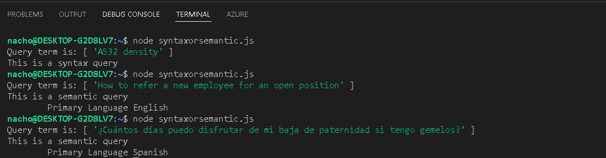

For documentation on how to import the npm package in your environment please check: https://docs.microsoft.com/en-us/azure/cognitive-services/language-service/language-detection/quickstart?pivots=programming-language-javascript#setting-up

To learn how to create an Azure Cognitive Services Language and the key and endpoint details please check https://docs.microsoft.com/en-us/azure/cognitive-services/cognitive-services-apis-create-account?tabs=multiservice%2Cwindows

The output will look like 

This repo will be updated if/once this query classifier is integrated for an end to end Knowledge Mining accelerator experience
